# Ejercicio 3 — Singleton

## 🎯 Paso 2: La curva — múltiples instancias, un problema silencioso

El equipo creció. Ahora la aplicación tiene **tres módulos independientes**,
cada uno desarrollado por una persona diferente:

- `HomeScreen` — muestra la configuración al iniciar.
- `SettingsScreen` — permite cambiar el idioma.
- `SyncService` — un servicio de fondo que sincroniza datos con el servidor.
  Usa la `urlServidor` de la configuración para saber a dónde conectarse.

---

## Tu tarea (sin patrones todavía)

1. Creá la clase `SyncService` con un método `sincronizar()` que reciba
   un `ConfigManager` por parámetro e imprima la URL a la que se conecta.

2. Escribí el siguiente cliente **exactamente como está**:

3. Ejecutá el código mentalmente (o de verdad) y respondé:
    - ¿Qué idioma muestra `HomeScreen` la segunda vez?
    - ¿Es el idioma que el usuario eligió en `SettingsScreen`?
    - ¿Por qué?

---

## Pregunta para responder

1. Si el sistema tuviera 10 pantallas y 5 servicios, todos necesitando
1. la misma configuración, ¿cómo garantizarías que todos usan
1. la misma instancia **sin usar Singleton**?
1. ¿Qué tan frágil sería esa solución?

## Cosas para sentir mientras lo hacés

🔴 **¿Quién es el responsable de crear el `ConfigManager`?**
No hay ninguna regla que lo impida — cualquiera puede hacer `new ConfigManager(...)`.
El compilador no te avisa si creás 10 instancias distintas.

🔴 **¿Cómo garantizás que todos usan la misma instancia?**
Con disciplina y convención, no con estructura. Si un nuevo desarrollador
entra al equipo y no sabe que "hay que pasarle el mismo objeto a todos",
va a crear una instancia nueva y el bug va a aparecer en producción.

🔴 **¿Qué pasa si la URL del servidor cambia en runtime?**
Si `SyncService` tiene su propia instancia, nunca va a ver el cambio.
Va a seguir apuntando a la URL vieja.

🔴 **¿Cuántos `new ConfigManager(...)` hay en el sistema?**
Contalos. Cada uno es un punto donde alguien puede olvidarse de sincronizar.

---

## Diagrama de clases final

